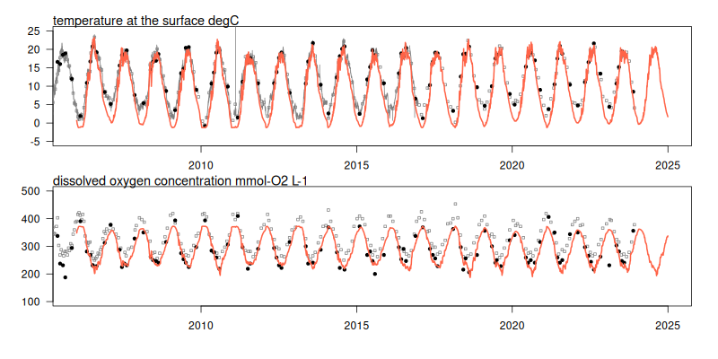

# Summary

OxyPOM (Oxygen and Particulate Organic Matter) and DiaMO (Diagnostic Model for Oxygen) are aquatic biogeochemical models that consider key processes for dissolved oxygen (DO)s, such as re-aeration, mineralization, and primary production, in fresh, transitional and marine waters.
Both are implemented in the `Fortran`-based Framework for Aquatic Biogeochemical Models [FABM, @Bruggeman2014] for interoperability in a variety of hydrodynamic models, in realistic and idealized applications, and for coupleability to other aquatic process models.
With these models, we include an updated light profile implementation and testcases for simulating DO at Cuxhaven Station in the Elbe estuary 2005--2024; for this, we use the hydrodynamic General Ocean Turbulence Model (GOTM) [@Burchard2002] including tides, and `R` and `bash` scripts for including weather and river data from [kuestendaten.de](https://www.kuestendaten.de).

# Statement of need

Dissolved oxygen (DO) is a key variable for assessing water quality and ecological state of aquatic ecosystems [@EC2006].
Most existing models describe DO dynamics as a side product of more or less complex (a)biotic dynamics.
OxyPOM and DiaMO remove  much of this complexity and focus on the key processes that produce or consume oxygen.
A predecessor 1D long-channel version of **OxyPOM** was initially implemented by @Holzwarth2018 specifically for the closed-source UnTRIM-DELWAQ hydrodynamic and water quality system. 
This implementation lacked portability, and was neither findable, nor accessible, interoperable or reusable (FAIR).  The reimplementation with the FABM API ensures FAIR principles, foremost the (1) interoperability with many hydrodynamic models; (2) applicability in different topological domains, and (3) coupleability to other aquatic process models.
We introduced vertically explicit formulations for re-aeration, primary production, and light attenuation.
Where a complete representation of bio-geochemical dynamics is not needed, **DiaMO** is an even more simplified model for quick assessments of DO dynamics.

## OxyPOM: Oxygen and Particulate Organic Matter

The model OxyPOM resolves the dynamics of
dissolved oxygen (DO),
(semi-)labile particulate organic matter (POM) pools, 
silicate particles,
dissolved organic matter (DOM),
inorganic dissolved nutrients,
and two micro-algae classes.
DO dynamics is based on a mass balance equation:

\begin{equation}
\frac{d \textrm{DO}}{dt} = \textrm{Re-aeration} + (\textrm{Photosynthesis} - \textrm{Respiration}) - \textrm{Mineralization} + \textrm{Nitrification}.
\label{eq:do}
\end{equation}

Re-aeration occurs in the surface layer as a function of temperature, salinity and wind speed [@Weiss1970].
Photosynthesis is limited by nutrient concentration and light intensity with an exponential saturation [@Platt1980].
Respiration includes oxygen consumption for micro-algae.
Mineralization and Nitrification is the oxygen consumed to transform matter from organic to inorganic forms and to oxidize ammonia into nitrate, respectively.

Temperature-dependent rates limit these processes.  Settling velocities are set constant, and vertical redistribution of matter is carried out by diffusion and advection terms provided by the hydrodynamical model.

In OxyPOM, POM and DOM have an explicit elemental composition (carbon, nitrogen and phosphorus).
POM is present in two qualities, (semi-)labile, which transition in the sequence labile $\rightarrow$ semi-labile $\rightarrow$ dissolved.
POM and DOM mineralize to inorganic dissolved inorganic nutrients: nitrogen and ortho-phosphate.
Dissolved inorganic nitrogen is further subdivided into ammonium and nitrate.
Ammonia transitions to nitrate as a function of DO.
Silicate is present in dissolved--bio-available-- and particulate mineral forms.
The two micro-algae classes (one with dependence on dissolved silicate, thus representing diatoms) have growth rates that depend on photosynthesis; their growth rates depend on dissolved nitrogen and ortho-phosphate concentrations, 
Micro-algae uptake dissolved inorganic nutrients and release dissolved nutrients when they die with a temperature-dependent mortality rate.

We validate both models in the Cuxhaven station in the Elbe estuary, where OxyPOM shows high skill by reproducing surface DO.

{ width=99% }

## DiaMO: Diagnostic Model for Oxygen

DiaMO resolves the dynamics of DO, living and non-living organic particulate carbon forms (Phytoplankton (Phy) and Detritus (Det), respectively) under the assumption that light, not nutrients, is the limiting factor for photosynthesis; DiaMO is a carbon-only implementation.
DO is solved with the mass balance equation of OxyPOM (\autoref{eq:do}), setting nitrification to zero.
The complete system is represented as

\begin{eqnarray}
\frac{d \textrm{Phy}}{dt} &=& \textrm{Photosynthesis} - \textrm{Respiration} - \textrm{Aggregation} \\
\frac{d \textrm{Det}}{dt} &=& \textrm{Aggregation} - \textrm{Mineralization} \\
\frac{d \textrm{DO}}{dt} &=& \textrm{Re-aeration} + (\textrm{Photosynthesis} - \textrm{Respiration}) - \textrm{Mineralization}.
\end{eqnarray}

Aggregation rate is a mortality term for phytoplankton [@Maerz2009].
As in OxyPOM, all rates in DiaMO are temperature-dependent.

## Light in OxyPOM and DiaMO

Together with OxyPOM and DiaMO, this repository includes the model `oxypom/light` as an alternative model to the FABM implementation of the light model used by GOTM.
While the default light model assumes that the photosynthetically active radiation (PAR) in a vertical layer $z$ of thickness $\Delta z$ is in the centre of the layer, `oxypom/light` calculates PAR in the representative depth $\bar{z}$, which satisfies the mean value theorem, such that 
PAR evaluated at $\bar{z}$ is the mean PAR intensity in the layer.
Since this calculation can be computationally expensive to evaluate, first- and second-order approximations are implemented.
The first-order solution is equal to the centre of the layer $z + \frac{1}{2} \Delta z$, and the second-order approximation is

\begin{equation}
\bar{z} = z + \frac{1}{2} \Delta z - \frac{\alpha}{3} \Delta z ^ 2,
\label{eq:secondorder}
\end{equation}

where $\alpha$ is the light extinction coefficient for the layer, accounting for physical and biological light absorption, assuming an exponential light decay.

# Model documentation and license

The models are documented in short form in the `ReadMe.md` section of the repository and a complete description of the science behind OxyPOM is in @Holzwarth2018.
Open access data from third parties are not included with the model, and scripts for their download are included.
Our own models, scripts and documentations are are released under open source licenses, foremost Apache 2.0, CC0-1.0, and CC-BY-SA-4.0; a comprehensive documentation of all licenses is provided via REUSE Software.

# Acknowledgements

The development of this model was made possible by the grant no. 03F0954D of the BMBF as part of the DAM mission ‘mareXtreme’, project ElbeXtreme. We are grateful for the open source community that facilitated this research, amongst them the developers of and contributors to FABM, GOTM, R, pandoc, and LaTeX.

# References
